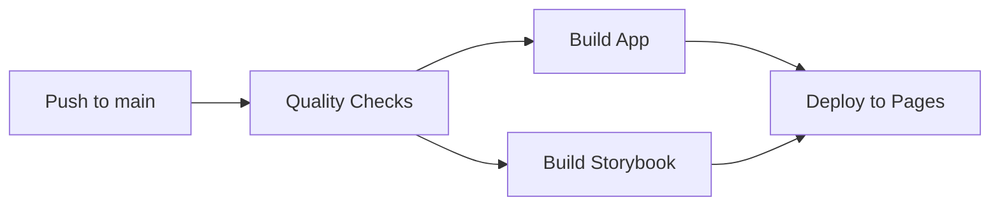

# GitHub Actions Workflows

## 📁 Pliki workflow

### `deploy.yml`

Główny workflow CI/CD, który:

- Uruchamia quality checks (ESLint, Prettier)
- Buduje aplikację i Storybook
- Deployuje na GitHub Pages (tylko z main branch)

## 🔄 Proces deployment



## 🎯 Jobs

### 1. quality-checks

- Sprawdza kod za pomocą ESLint
- Weryfikuje formatowanie Prettier
- Blokuje dalsze kroki jeśli znajdzie błędy

### 2. build-app

- Buduje główną aplikację portfolio
- Tworzy artifact `app-dist`
- Wymaga przejścia quality-checks

### 3. build-storybook

- Buduje Storybook
- Tworzy artifact `storybook-static`
- Wymaga przejścia quality-checks
- Działa równolegle z build-app

### 4. deploy

- Łączy oba buildy w jeden katalog
- Tworzy welcome page z linkami
- Publikuje na GitHub Pages
- Uruchamia się tylko dla push do main

## 📦 Artifacts

Workflow tworzy dwa artifacts:

- `app-dist` - zbudowana aplikacja (retention: 1 dzień)
- `storybook-static` - zbudowany Storybook (retention: 1 dzień)

## 🌳 Branch strategy

- **main** - automatyczny deployment po każdym push
- **inne branche** - tylko quality checks i buildy, bez deploymentu
- **pull requests** - pełne testy bez deploymentu

## 🔒 Security

Workflow używa:

- `npm ci` zamiast `npm install` dla deterministycznych instalacji
- Pinned versions dla GitHub Actions (`@v4`)
- Minimalne uprawnienia GITHUB_TOKEN
- Concurrency control dla deploymentów

## ⚡ Performance

- Cache npm dependencies dla szybszych buildów
- Równoległe budowanie app i Storybook
- Artifacts retention na 1 dzień (zamiast domyślnych 90)
- Concurrency control - nie anuluje bieżących deploymentów

## 🛠️ Customizacja

### Zmiana Node.js version

```yaml
- name: Setup Node.js
  uses: actions/setup-node@v4
  with:
    node-version: "20" # Zmień tutaj
```

### Dodanie testów jednostkowych

Dodaj przed build jobs:

```yaml
test:
  name: Run Tests
  runs-on: ubuntu-latest
  needs: quality-checks
  steps:
    - uses: actions/checkout@v4
    - uses: actions/setup-node@v4
      with:
        node-version: "22"
    - run: npm ci
    - run: npm test
```

### Deployment na staging

```yaml
deploy-staging:
  if: github.ref == 'refs/heads/develop'
  # deployment na inne środowisko
```

## 📊 Status badges

Dodaj do README.md:

```markdown

```

## 🔍 Monitoring

Sprawdź:

- **Actions tab** - historia wykonań
- **Environments** - deployment history
- **Pages settings** - aktualny status strony

## 💡 Tips

1. **Cache warming** - Pierwszy build może być wolny, kolejne będą szybsze dzięki cache
2. **Concurrent deployments** - Workflow nie anuluje bieżących deploymentów
3. **Manual trigger** - Możesz uruchomić workflow ręcznie z Actions tab
4. **PR previews** - Artifacts są dostępne do pobrania dla PR (bez auto-deployment)

## 🐛 Debug

Jeśli coś nie działa:

1. Sprawdź logs w Actions tab
2. Zweryfikuj uprawnienia w Settings → Actions
3. Upewnij się że GitHub Pages jest włączony
4. Sprawdź czy secrets są poprawnie skonfigurowane (jeśli używasz)

## 📝 Maintenance

- Regularnie aktualizuj wersje Actions
- Monitoruj deprecated features
- Sprawdzaj security advisories dla dependencies
